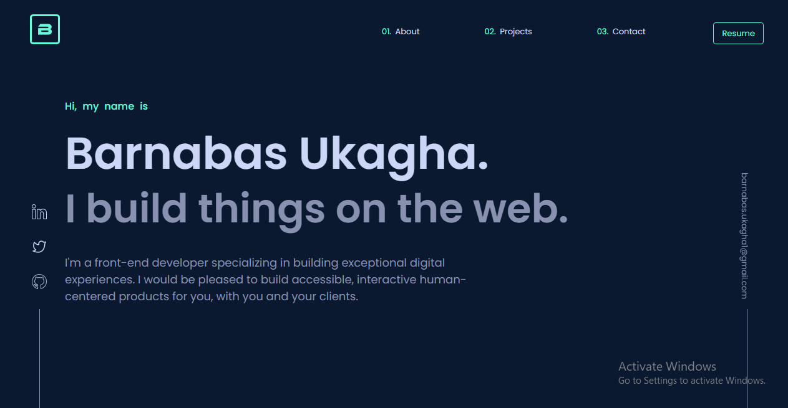

## Table of contents

- [Overview](#overview)
  - [The Project](#the-project)
  - [Screenshot](#screenshot)
  - [Links](#links)
- [My process](#my-process)
  - [Built with](#built-with)
  - [Useful resources](#useful-resources)
- [Author](#author)
- [Acknowledgments](#acknowledgments)

## Overview

### The project

This is a personal porfolio that showcase my skill as a front-end developer.

### Screenshot

### Links

- Solution URL: [https://github.com/Barnabas-U/My-Portfolio](Github)
- Live Site URL: [https://euphonious-torrone-dbf56e.netlify.app/](Netlify)

## My process

### Built with

- Semantic HTML5 markup
- CSS Grid
- CSS custom properties
- Flexbox
- CSS positions
- Mobile-first workflow
- javaScript
- [Tailwind CSS](https://tailwindcss.com/) - CSS framework
- [Sass](https://sass-lang.com/) - For styles

### Useful resources

- [w3schools](https://www.w3schools.com/) - This helped me learn and master javaScript. I really liked how easy it is to learn on the website. I recommend.

## Author

- Website - [Barnabas Ukagha](https://euphonious-torrone-dbf56e.netlify.app/)
- Frontend Mentor - [@yourusername](https://www.frontendmentor.io/profile/yourusername)
- Twitter - [@iammcbarna](https://twitter.com/iammcbarna)
- Linkedin - [Barnabas Ukagha](https://www.linkedin.com/in/barnabas-ukagha-33059121b/)
## Acknowledgments

I wanna thank w3schools.com for making it easy for anyone and myself to sturdy on the platform.